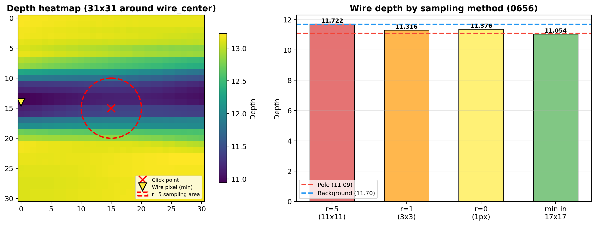
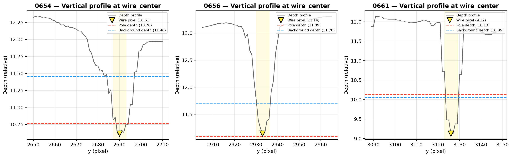
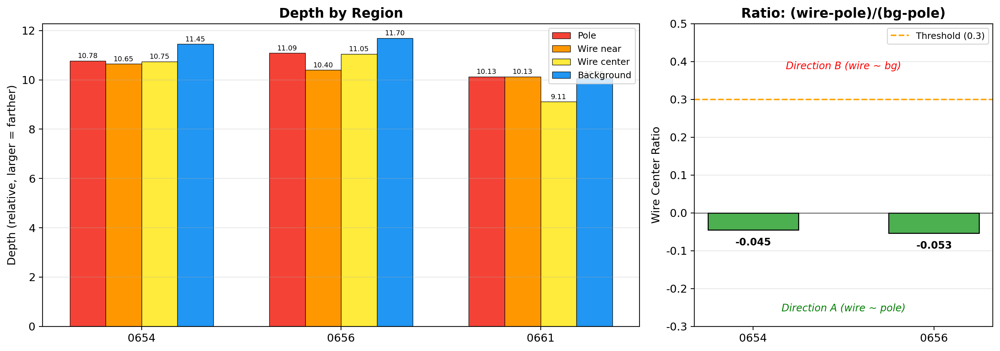

# 사전 실험 결과 보고서

## 실험 배경

### 문제 정의

드론 multi-view 이미지에서 전선(power line) 같은 thin structure의 3D reconstruction은
MVS(Multi-View Stereo)에서 근본적으로 어렵다.

- **원인**: 전선은 1~3 pixel 폭으로 texture가 극도로 부족 → stereo matching 실패 → depth map에 결손
- **결과**: MVS dense depth map에서 전선 위치에 구멍(hole)이 발생
- **영향**: 전선의 3D reconstruction이 불가능하거나 심각하게 왜곡

### 해결 접근: Depth Foundation Model + Metric Prior

Depth foundation model(Depth Anything 등)은 single-image로 구조적으로 타당한 relative depth를 추정하며,
전선 같은 thin structure도 인식할 수 있다. 단, relative depth이므로 scale/shift가 없다.

**Prior Depth Anything**은 MVS sparse metric points를 prior로 사용하여
foundation model의 relative depth를 metric depth로 변환한다.

이 접근이 전선에 유효하려면 핵심 조건이 있다:

> Foundation model이 전선의 depth를 전주(pole)에 가깝게 추정해야,
> MVS sparse points에 포함된 전주의 metric depth가 전선으로 전파될 수 있다.

### 사전 실험의 질문

**Foundation model의 relative depth에서, 전선의 depth가 전주에 가까운가, 배경 건물에 가까운가?**

이 답에 따라 연구 방향이 달라진다:

| 결과 | 연구 방향 |
|------|-----------|
| 전선 ≈ 전주 | **A**: MVS sparse prior만으로 충분. Catenary 불필요. 범용적. |
| 전선 ≈ 배경 | **B**: Catenary 물리 모델로 전선에 직접 metric anchor 필요. 특화적. |

---

## 실험 설계

### 데이터

- DJI 드론 촬영 이미지 180장 (8192×5460, 성수동 도시 환경)
- 전주와 전선이 함께 보이는 이미지 3장 선별: 0654, 0656, 0661

### Foundation Model

- **PatchFusion** (CVPR 2024) + Depth Anything V1 (ViT-L)
- 고해상도 패치 기반 처리: image_raw_shape=[5460, 8192], patch_split_num=[7, 8]
- 원본 해상도 유지 → 전선(1~3 pixel 폭)이 보존됨

### 영역 정의

웹 기반 interactive tool로 각 이미지에서 다음 영역의 좌표를 수동 지정:

| 영역 | 의미 | 기대 depth |
|------|------|------------|
| **pole_top** | 전주 꼭대기 | 카메라에서 중간 거리 |
| **wire_near_pole** | 전주 근처 전선 | pole_top과 유사 |
| **wire_center** | 전선 중앙부 (전주 사이) | ? (이것이 핵심 질문) |
| **background** | 전선 뒤 배경 건물 | 카메라에서 먼 거리 |

### 평가 지표

```
ratio = (wire_center_depth − pole_depth) / (background_depth − pole_depth)
```

| ratio | 해석 | 방향 |
|-------|------|------|
| < 0.3 | 전선 ≈ 전주 | A |
| 0.3~0.7 | 불명확 | 추가 실험 필요 |
| > 0.7 | 전선 ≈ 배경 | B |

---

## 실험 결과: 전체 이미지 Overview

3장의 선별 이미지에 대해 RGB와 PatchFusion depth map을 나란히 표시.
각 영역의 클릭 위치가 마커로 표시되어 있다.


- 🔴 Pole top — 🟠 Wire near pole — 🟡 Wire center — 🔵 Background
- Depth map에서 밝은 색(yellow) = 먼 거리, 어두운 색(purple) = 가까운 거리

---

## 실험 과정에서의 발견

### Depth Convention 확인

PatchFusion/DA V1 출력의 depth convention을 확인:

```
Sky (far from camera):    20.62
Ground (near camera):      8.53
→ larger value = FARTHER from camera
```

### Sampling 문제와 해결

**초기 분석 (잘못된 결과)**:
- sampling radius=5 (11×11 patch, 121 pixels)로 영역 평균을 계산
- wire_center ratio: 0654=1.273, 0656=1.074 → "방향 B"로 오판

**원인**: 전선은 2~3 pixel 폭인데 11×11 패치로 sampling하면 대부분이 배경 pixel.
전선의 실제 depth가 배경 pixel들에 의해 묻혀버림.

아래 그림은 이 문제를 시각화한 것이다:



- **왼쪽**: wire_center 주변 31×31 depth 히트맵. 빨간 원(r=5)이 sampling 영역이며, 전선 pixel(▼)과 클릭 위치(✕)가 다른 곳에 있다. r=5로 잡으면 대부분 배경을 포함.
- **오른쪽**: sampling 방법에 따른 wire depth 값. r=5(11×11)일 때 값이 background(파란 점선)에 가깝지만, min in 17×17으로 전선 pixel만 잡으면 pole(빨간 점선)에 가깝다.

**검증** — 0656의 wire_center(4734, 2935) 주변 수직 depth profile:

```
y=2930: 11.78  (배경)
y=2931: 11.38
y=2932: 11.24
y=2933: 11.14  ← 전선 pixel (depth 최소 = 가장 가까움)
y=2934: 11.16
y=2935: 11.38  ← 클릭 좌표 (전선에서 2px 벗어남)
y=2936: 11.41
y=2937: 11.92  (배경)
```

전선 pixel(y=2933)의 depth 11.14는 배경(11.78)보다 **확실히 작고**(= 더 가까움),
전주(11.09)와 **거의 동일**하다.

**해결**: wire 영역은 클릭 주변 17×17에서 depth 최소값을 채택 (= 전선 pixel의 실제 depth).

### 교훈

1. **Thin structure의 depth sampling은 특별한 처리가 필요**하다.
   일반적인 patch 평균은 주변 배경에 의해 오염된다.
2. **클릭 좌표가 pixel-level로 정확하지 않을 수 있다**.
   전선 폭이 2~3px이면 1~2px만 벗어나도 배경을 sampling하게 된다.
3. 이 문제는 Prior DA에서도 동일하게 발생할 수 있다 — 논문에서 논의할 가치가 있음.

---

## 최종 결과

### Wire Center 수직 Depth Profile

각 이미지의 wire_center 위치에서 수직(y) 방향 depth profile을 추출.
전선 pixel(▼)이 배경보다 낮은 depth(= 더 가까움)에 위치하며, pole depth(빨간 점선)에 가깝다.



- 0654, 0656: 전선 pixel의 depth dip이 뚜렷. pole depth 수준까지 내려감.
- 0661: 전선 pixel이 pole/bg보다 더 가까운 depth를 가짐 (전선이 카메라 쪽으로 돌출).

### 영역별 Depth 비교 및 Ratio



- **왼쪽**: 3장의 이미지에서 4개 영역(Pole, Wire near, Wire center, Background)의 depth.
  Wire center(노랑)가 항상 Background(파랑)보다 작다 (= 더 가까움).
- **오른쪽**: Wire center ratio. 두 이미지 모두 0.3 threshold 아래이며 음수 (전선이 전주보다도 약간 가까움).

### 보정된 수치 (wire: 주변 최소값, pole/bg: r=1 평균)

| 이미지 | Pole | Wire near | Wire center | Background | ratio | 판정 |
|--------|------|-----------|-------------|------------|-------|------|
| 0654 | 10.78 | 10.65 | 10.75 | 11.45 | **-0.045** | A |
| 0656 | 11.09 | 10.40 | 11.05 | 11.70 | **-0.054** | A |
| 0661 | 10.13 | 10.13 | 9.11 | 10.05 | N/A (*) | A |

(*) 0661: pole(10.13)과 background(10.05)의 차이가 0.08로 ratio 분모가 너무 작아 수치 해석 불가.
    단, wire(9.11)가 pole과 bg 모두보다 작으므로(= 더 가까움) 방향 A와 일관.

### 해석

**3장 모두에서**:
- 전선(wire center)의 depth < 배경(background)의 depth
- 전선의 depth ≈ 전주(pole)의 depth
- ratio < 0.3 (0661 제외, 분모 문제)

---

## 결론

> **방향 A 채택 가능.**
>
> PatchFusion/Depth Anything V1은 전선의 relative depth를
> 배경 건물이 아닌 전주에 가깝게 추정한다.
>
> 따라서 Prior Depth Anything에 MVS sparse points(전주 포함)를 넣으면
> 전주의 metric depth가 전선으로 전파될 가능성이 높다.
> Catenary 물리 모델은 불필요.

### 제한사항

1. **3장 분석**: 더 다양한 시점/장면에서 확인 필요 (본 실험에서 수행)
2. **Relative depth만 확인**: 실제 Prior DA fusion 후에도 전파가 되는지는 Step 3에서 검증 필요
3. **DA V1 기반**: Depth Anything V2에서도 동일한 경향인지 확인 필요 (ablation)
4. **도시 환경 한정**: 전선 배경이 하늘인 경우 다를 수 있음

---

## 부록: 실험 환경

| 항목 | 내용 |
|------|------|
| GPU | NVIDIA RTX 3090 × 2 (24GB) |
| Foundation Model | PatchFusion + Depth Anything V1 ViT-L |
| 모델 소스 | `Zhyever/patchfusion_depth_anything_vitl14` (HuggingFace) |
| 처리 시간 | ~84초/장 (180장 전체 ~4.2시간) |
| 이미지 해상도 | 8192×5460 (원본 유지) |
| Patch 설정 | image_raw_shape=[5460,8192], patch_split_num=[7,8] |
| 영역 지정 | 웹 기반 interactive selector (vanilla HTML/JS) |

---

*작성: 2026-04-02*
*이 문서는 docs/experiment_plan.md의 맥락 문서로, 실험 계획이 도출된 근거를 제공한다.*
